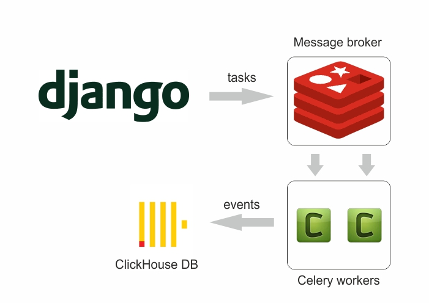

# Решение тестовой задачи

Для решения проблемы синхронной записи логов напрямую в CH я использовал шаблон Transactional Outbox с асинхронной обработкой событий через Celery:

1) Создал таблицу в нашей БД "event_outbox" с такими же колонками, что и в CH.
- Реализовал через создание модели "EventOutbox" в приложении users (models.py)
- При создании экземпляра класса User создается соответствующий экземпляр класса EventOutbox
  (реализация в методе _log класса CreateUser users/use_cases/create_user.py)
2) Создаем таску Celery для отправки логов в СН (users/tasks.py)
- Реализовал отправку пакетами не менее 1000 строк (CH страдал от большого количества построчных записей)
- Реализовал периодическое выполнение задачи (core/celery.py). 
  Проверка (размер пакета не меньше 1000 строк) и отправка логов каждую минуту
3) Тестирование:
- Изменил логику существующих юнит-тестов (users/use_cases/create_user_tests.py)
- Добавил тесты для новой модели (users/use_cases/create_event_outbox_tests.py)
4) Логирование и трассировка: добавил логирование к новому коду с использованием structlog и также трассировку redis через Sentry

Все изменения кода можно посмотреть в коммите "task_done"
